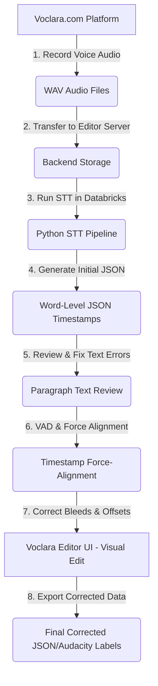

# Voclara Data Processing Workflow

This document outlines the end-to-end conversation data pipeline for Voclara recordings, moving from voice acquisition to final aligned and corrected word-level timestamps.

---

---

## Pipeline Stages

### Stage 1: Audio Recording (`voclara.com`)
* **Process:** Native speakers log into [voclara.com](https://voclara.com) and participate in recording tasks (reading scripts or engaging in two-way conversations).
* **Outputs:** Raw audio files (standard formats, e.g., WAV).

### Stage 2: Data Transfer
* **Process:** The recorded WAV audio files are transferred from the production website servers to this local Voclara Audio Timestamp Editor system (saving them into the `backend/uploads/` directory).

### Stage 3: Speech-to-Text (STT) Generation (`Databricks`)
* **Process:** Databricks clusters run a Python-based STT model (such as Whisper or similar alignment models) on the raw audio.
* **Outputs:** A structured word-level JSON timestamp file containing the transcription text and approximate starting/ending bounds.

### Stage 4: Paragraph Transcription Review & Text Fixes
* **Process:** Before editing timings, the transcription is reviewed in the editor as a continuous text paragraph (the **Transcription** tab). 
* **Focus:** Fix any word-level transcription errors (spelling mistakes, incorrect words, grammatical adjustments, missing words, punctuation). The text contents must match the audio exactly before aligning.

### Stage 5: Voice Activity Detection (VAD) & Force Alignment
* **Process:** A Python VAD analysis runs to identify silent segments, followed by force-alignment algorithms to map the corrected paragraph text to precise audio time boundaries.

### Stage 6: Visual Timestamp Adjustment (Voclara Editor UI)
* **Process:** The audio track and aligned labels are loaded into this Voclara Editor UI.
* **Focus:** A human editor manually reviews the visual waveform track and drags the boundaries of individual word boxes to:
  * Fix **audio bleeding** (where the end of a word overlaps into the next word's boundary, or silent padding).
  * Fix **long timestamp errors** (where a word label spans a silence or is incorrectly stretched).
  * Correct misaligned offsets at the beginning/end of sentences.

### Stage 7: Export
* **Process:** The final corrected labels are downloaded from the editor UI as Audacity `.txt` labels or standard `.json` format, ready to be ingested back into the Voclara AI training pipeline.
